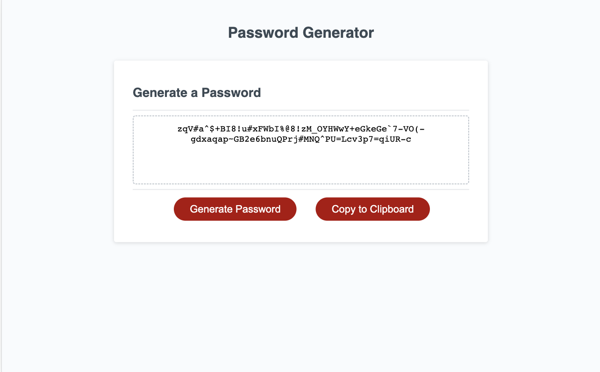

# Random Password Generator

## Description

I wanted to randomly generate a password with specific attributes for greater security.
This project helped me explore JavaScript and allowed me to utilize prompts, functions, and strings.
The biggest takeaway for me was breaking things down into smaller parts and addressing them one at a time. Organization continues to be critical. 

## Usage

Click the red "Generate Password" button and respond to the prompts. If an error is given, try again. 
Once the selections are made correctly, a random password will be printed in the box as seen in the screenshot below.

## Features

Button was added to allow the user to copy the newly generated password to the clipboard.

## Deployment

[Random Password Generator](https://katemcro.github.io/W3-PassGen/)
    

## License

MIT License

Copyright (c) 2023 Kate Rogers

Permission is hereby granted, free of charge, to any person obtaining a copy
of this software and associated documentation files (the "Software"), to deal
in the Software without restriction, including without limitation the rights
to use, copy, modify, merge, publish, distribute, sublicense, and/or sell
copies of the Software, and to permit persons to whom the Software is
furnished to do so, subject to the following conditions:

The above copyright notice and this permission notice shall be included in all
copies or substantial portions of the Software.

THE SOFTWARE IS PROVIDED "AS IS", WITHOUT WARRANTY OF ANY KIND, EXPRESS OR
IMPLIED, INCLUDING BUT NOT LIMITED TO THE WARRANTIES OF MERCHANTABILITY,
FITNESS FOR A PARTICULAR PURPOSE AND NONINFRINGEMENT. IN NO EVENT SHALL THE
AUTHORS OR COPYRIGHT HOLDERS BE LIABLE FOR ANY CLAIM, DAMAGES OR OTHER
LIABILITY, WHETHER IN AN ACTION OF CONTRACT, TORT OR OTHERWISE, ARISING FROM,
OUT OF OR IN CONNECTION WITH THE SOFTWARE OR THE USE OR OTHER DEALINGS IN THE
SOFTWARE.
